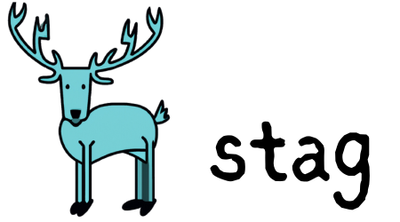

Stag is an open-source Go library designed to simplify the parsing of struct tags by generating a parser based on a declarative grammar.

[](https://github.com/connormckelvey/stag/actions?query=workflow%3ATest)


## Get Started

### Install
```bash
go get github.com/connormckelvey/stag
```

### Import
```go
import "github.com/connormckelvey/stag"
```

### Define grammar
```go
type CliFlagGrammar struct {
	Name    string   `grammar:"flag,0,name"`
	Aliases []string `grammar:"flag,1,aliases"`
	Usage   string   `grammar:"flag,2,usage"`
}
```

### Generate parser
```go
var FlagParser = stag.MustGenerate(CliFlagGrammar{})
```

### Parse
```go
type MyFlags struct {
    Props   any `flag:"props,p,Load the props file"`
    Include any `flag:"include,i,Specify file or glob"`
}

results, err := FlagParser.Parse(MyFlags{})
if err != nil {
    panic(err)
}


// output:
// {Name:props Aliases:[p] Usage:Load the props file}
// {Name:include Aliases:[i] Usage:Specify file or glob}
for _, tagValues := range results {
    fmt.Printf("%+v\n", tagValues)
}
```